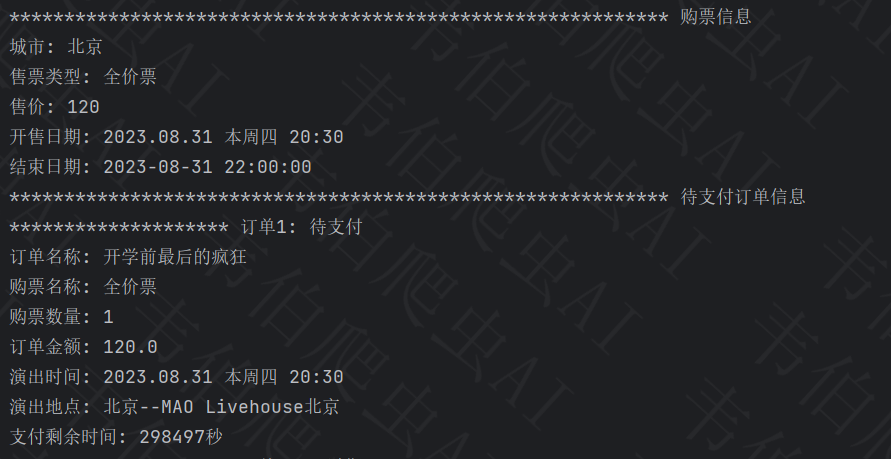
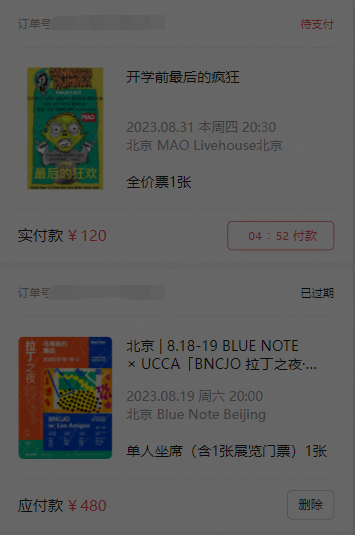

# 秀动购票_exe程序

# 声明

本文章中所有内容仅供学习交流，抓包内容、敏感网址、数据接口均已做脱敏处理，严禁用于商业用途和非法用途，否则由此产生的一切后果均与作者无关，若有侵权，请联系我立即删除！

# 使用说明

> 本文仅提供打包好的exe可执行程序，具体分析流程参见公众号文章[某秀dong js逆向分析 发包抓取](https://mp.weixin.qq.com/s?__biz=Mzg2MTY5NTU0Mg==&mid=2247483822&idx=1&sn=712f7354d2c4d77184e18d4cfc713605&chksm=ce127af7f965f3e10e7edce45c31c339f661723425456cbebb2a1dc2ae560e549d09a6ef59ba&payreadticket=HCNUaBeglLKJ_TM6OZInN-WuJM-vHkVF5BFDg1w6LN9UYwIlPWmWJXlYCuq-R8l9QxIF0yY)。
>
> 

解压后主要文件如下：


## config.int

```ini
[ticket]
;票ID
activityid = 204369  
;购票日期(索引)
date_ = 0
;购票场次(索引)
ticket_file = 0
;购票数量
ticketnum = 1

[user]
;用户电话
mobile = 123456
;用户sign(可不填)
sign = 
;用户userid(可不填)
userid =
```

# 效果演示





# 运行方式

window10系统下，双击运行`xiu.exe`即可。

注：必须提前按照个人情况写好`config.int`配置信息

# 获取方式

公众号后台回复**荻花之秀**，获取下载链接

# 欢迎关注


